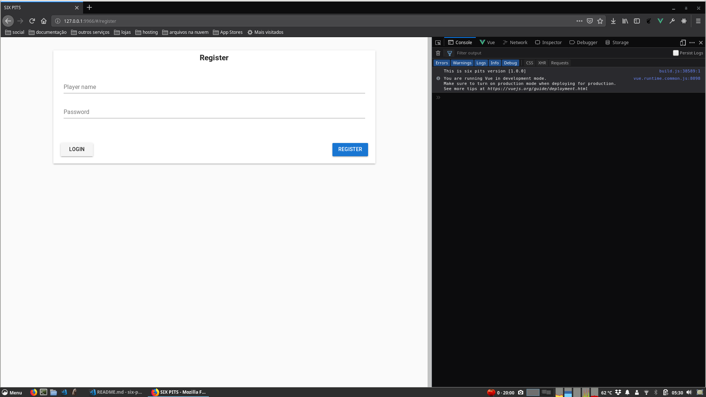
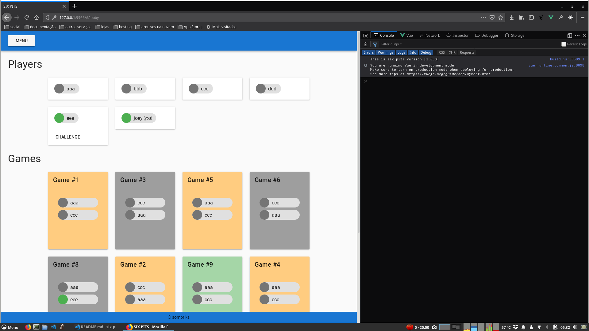
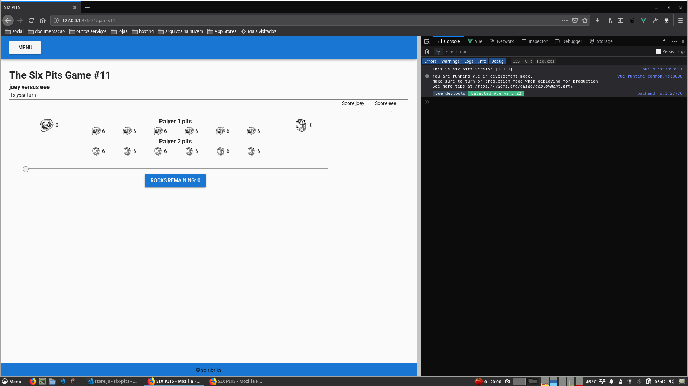

# six-pits-web

Web module for six-pits solution

## Development requirements

- Visual Studio Code with [Vue VSCode Extension Pack](https://marketplace.visualstudio.com/items?itemName=sdras.vue-vscode-extensionpack)
- Linux or mac os machine (tested on mac os mojave and fedora linux 28)
- Node latest LTS with npm

## Usage

Once the [running instructions](../README.md) get executed, this login screen will appear:

Click on `REGISTER`:

And that's it, you're in the lobby:

Now open another browser (one chrome and one firefox or a incognito session) and repeat the process in order to make
another player.

That way you can challenge each other.

Please note:

- Challenged player must accept the game
- You can leave and return to a certain game anytime

The game screen looks like this:

## Issues

Other players over the network might not see your game.

At first you can resolve it by removing the `-H 127.0.0.1` portion present in `package.json` **dev** script. 

But you also will need to alter the **baseURL** present in `src/store.js` to match service ip and port.

## Directions planned but not implemented

- Test coverage for vue single file components
- Firebase hosting publishing or any other static host
- Reverse communication with server using websockets or something else
- ESLint to create a common idiom to be respected by a future team
